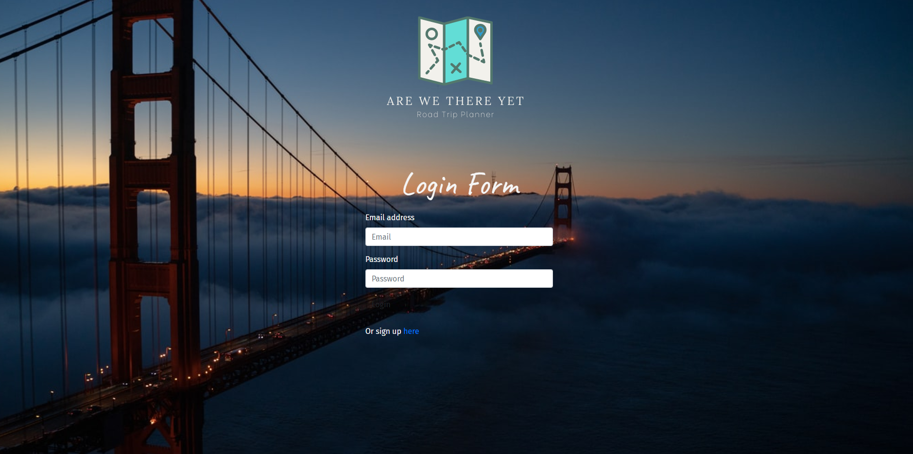
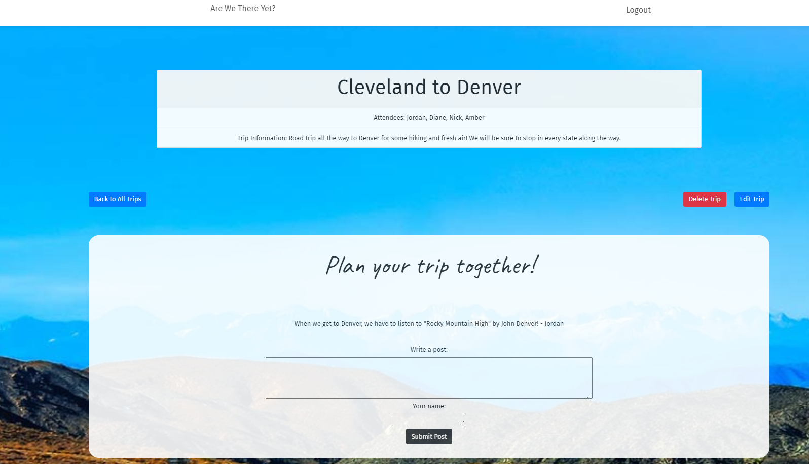

# Are_We_There_Yet
Project 2 Team Build Are We There Yet?

This is a CWRU coding bootcamp Project 2 Team Assignment.  This project is to show that the students are able to work in a team setting, come up with an original idea and collaborate together to develop a project.  This project demonstrates the students ability to become comfortable working in a group setting and learning the functionality of GitHub. This project uses the project board function using Kanban and the agile software development method of GitHub which allows for the students to create and delegate tasks.  The group members needed to communicate effectively and work together to build a functioning application.  The technologies used were bcrypt, express, express-handlebars, express-session, lodash, mysql2, passport, passport-local, and sequelize.  Styling was done using bootsrtrap.

## User Story

This app was designed for a group of friends that are planning a road trip together and want to organize where they are going, what they want to do on the trip.  Normally as a group of friends a trip is organized via group text message and can leave the user feeling unorganized.  This application allows a user to store the information of each trip and and keep the trip organized allowing them to meticulously plan their trip.

Deployed application link: (https://arewethereyet.herokuapp.com)

The following images demonstrate the application functionality:

## Table of Contents

* [Installation](#installation)
* [Usage](#usage)
* [Credits](#credits)
* [Contributing](#contributing)
* [Tests](#tests)
* [Future](#future)

## Installation

If downloading from the repository a user must have node installed.  They can downlaod the technologies used by running npm install from the command line.

## Usage 

Download the code and open to view using your local host, or click the link above to view the deployed site.

## Credits

All Code was created from by Diane Furlong, Amber VanGieson, Nick Reese and Jordan Rantucci.  A special thanks to our instructor Eli for getting us out of some tough jams when we broke our code.

## Contributing

Contributions in the form of suggestions or feedback are appreciated.

## Tests

There are no tests for this project.

## Future 

Would like to include a map that allows the user to route their trip and guide them to each of their activites that they add on their trip. We would like the trip to be saved with the creators user ID so that only people who are attending the trip can see the plans, and the user can invite people going on the trip by adding them as attendees.  Additonal styling of page transitions would be applied in the future for a more modern UI.

---
